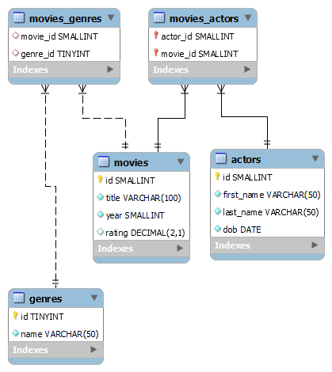

# SQl et MySQL

## A propos

Ce dépôt contient du matériel de soutien pour les cours **SQl** et **MySQL**

## Contenu

Ce dépôt est organisé comme suit :

- Vous pouvez trouver les présentations PDF du cours ci-dessous:
- Support du Cours
  - [Partie 1: Concepts de base et jointures](./Support%20HTML%205%20&%20CSS%203.pdf)
  - [Partie 2](./advanced/):
    - [Invite de commande](./advanced/1-invite-de-commande-sql.pdf)
    - [Views](./advanced/2-mysql-views.pdf)
    - [Triggers](./advanced/3-triggers.pdf)
    - [Stored Procedures](./advanced/4-procédures-stockées-dans-mysql.pdf)
- [Les TPs](./exerices/)
- [Fiche de Référence MySQL](./advanced/0-fiche-de-reference-mysql.pdf)

## Exemple projets

### TP Films

## Formateur

Nehemie Balukidi, [@olfredos6](https://github.com/Olfredos6)
